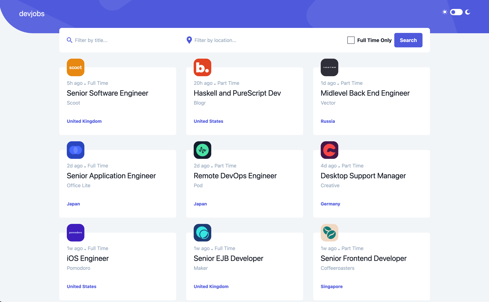

# Frontend Mentor - Devjobs web app solution

This is a solution to the [Devjobs web app challenge on Frontend Mentor](https://www.frontendmentor.io/challenges/devjobs-web-app-HuvC_LP4l).

## Table of contents

-   [Overview](#overview)
    -   [The challenge](#the-challenge)
    -   [Screenshot](#screenshot)
    -   [Links](#links)
-   [My process](#my-process)
    -   [Built with](#built-with)
    -   [What I learned](#what-i-learned)
-   [Author](#author)

## Overview

### The challenge

Users should be able to:

-   View the optimal layout for each page depending on their device's screen size
-   See hover states for all interactive elements throughout the site
-   Be able to filter jobs on the index page by title, location, and whether a job is for a full-time position
-   Be able to click a job from the index page so that they can read more information and apply for the job
-   **Bonus**: Have the correct color scheme chosen for them based on their computer preferences.

### Screenshot

### Links

-   Solution URL: [FEM Solution](https://www.frontendmentor.io/solutions/dev-jobs-reactnextjstailwindcss-Tz4Z7kV4GS)
-   Live Site URL: [Vercel Live site](https://dev-jobs-mauve.vercel.app/)

## My Process

### Built with

-   Semantic HTML5 markup
-   Mobile-first workflow
-   [React](https://reactjs.org/) - JS library
-   [Next.js](https://nextjs.org/) - React framework
-   [TailwindCSS](https://tailwindcss.com) - CSS library

### What I learned

-   NextJS can be bloatware for simple websites that require minimal navigation.
-   The current app / navigation structure is simple, but had to create an external wrapper component (JobContainer) to manage dark/light mode logic.
-   TailwindCSS classes can make components hard to read and understand.

## Author

-   Website - [Esteban Palacio](https://www.estebanpalacio.com)
-   Frontend Mentor - [@epalacio](https://www.frontendmentor.io/profile/epalacio)
-   Twitter - [@esti_pal](https://www.twitter.com/esti_pal)
